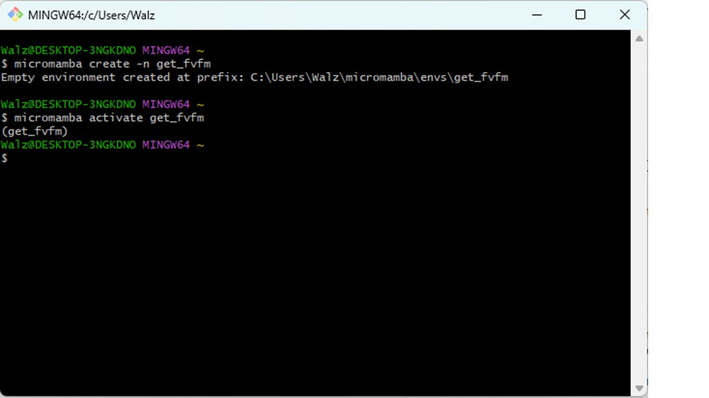
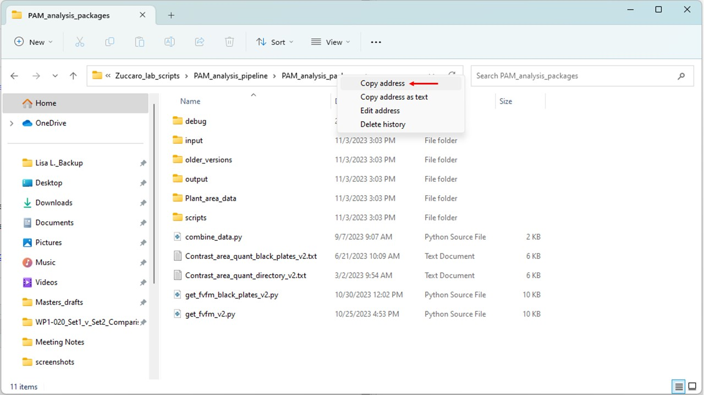
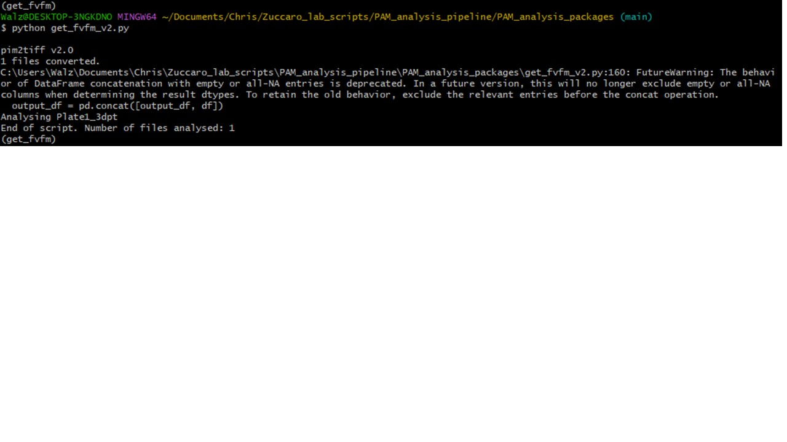
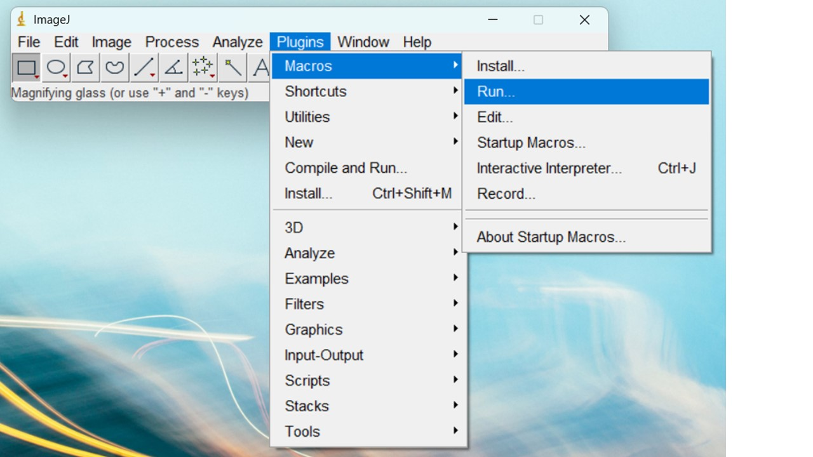
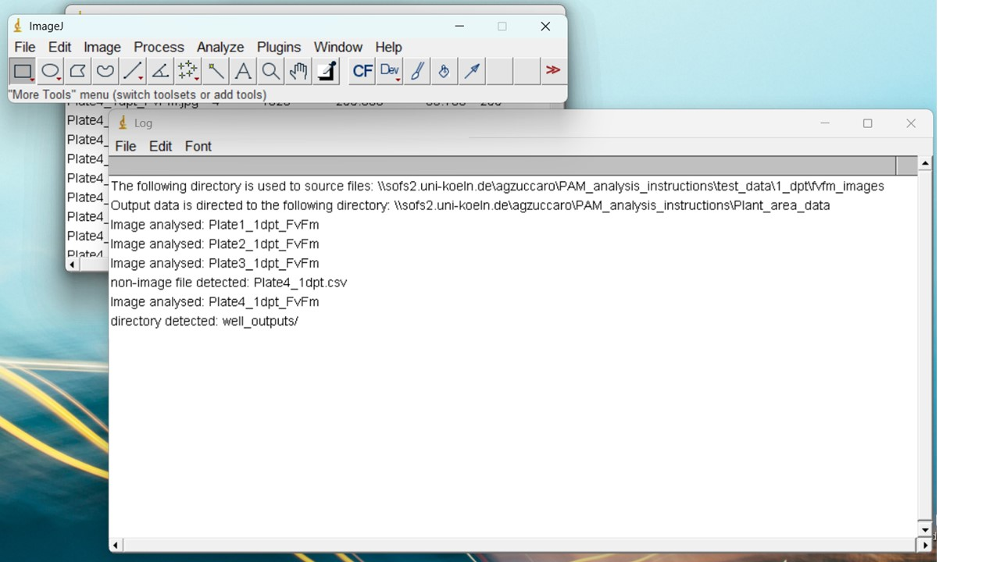
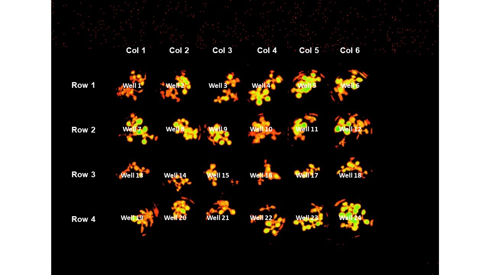

This document will guide you through the pipeline built for the semi-automated extraction of pulse amplitude modulation (PAM) fluorometry data from images generated using the PAM fluorometer:

- Using the Python script *get_fvfm.py* to extract FvFm data from .xpim files generated using the ImagingWin software.
- Using the ImageJ macro *Contrast_area_quant_directory.txt* to extract plant area data from "contrast" TIF images.
- Note: a separate set of these scripts exist for the "black plates" - cell culture plates which do not result in internal reflection which may affect photosynthetic area quantification.

## Imaging 24-well plates to generate .xpim files

_Described previously by Nick. See also "How to use the PAM camera.docx"_


1\. **Check the magnification of the PAM imaging camera**. This is located on the top of the PAM instrument. The magnification settings should be as shown in the image below. Note: this is *very important*, as an incorrect magnification can affect all downstream stages of the data analysis!


1\. Place the 24-well plates to be imaged in the drawer under the PAM imager laptop (in the microscopy room, 4.302). Leave them in the dark for 15 minutes. There is a notice on the door to the microscopy room: "Plants in dark/PAM imaging". Post this on the outside of the door to notify others that you require the room to stay dark.

2\. After 15 minutes, turn on the power supply and light source to the PAM imager (units to the left of the laptop). The switch for the light source is on the back of the unit.

3\. Password for the computer is "12345". Open ImagingWin software and select "MAXI" setting.

***Carry out following stages in the dark to keep plants dark-adapted***

4\. Lift the red shield around the imaging platform. Transfer the first 24-well plate from the drawer to the platform.
 
 - Note: *Place the plates flush against the barriers at the back and right side of the platform, to ensure uniform well positioning. This is very important for automated downstream analysis!*

5\. Lower the red shield before imaging the plate.

6\. On the ImagingWin GUI page, there is a large "Fo, Fm" button (see image above). Click on this to take image measurements.

7\. Above the "Fo, Fm" button, there are a series of options for image channels. Click on the "Fv/Fm" channel. The plants should be clearly highlighted against a black background.
 
 - If the plants are not clearly highlighted, they may not be fully dark-adapted. Return the plate to the drawer for at least 10 minutes, then repeat above steps.

8\. Left of the "Fo, Fm" button is a "save" icon. Click on that to save the output as a PIM file.
 
 - Save the file in your own folder within the Data_MAXI folder. Once saved, a comment file will open automatically. This can be closed without adding a comment.

9\. Click on "New Record" button, immediately above "Fo, Fm". Answer "no" to the prompt to save image data.

- Note: Selecting "New Record" will delete any unsaved data from the ImagingWin memory. Make sure you save the image as a PIM file before carrying out this stage.

10\. Repeat steps 4 to 9 for all plates.

## Extract photosynthetic efficiency (Y(II)) data from PIM files

### Part 1: Installation and set-up

This step *only has to be carried out the first time you follow this protocol*. For repeat use of the pipeline, skip to ~~Part 2~~.

1\. Install Git. Go to https://git-scm.com/downloads and click the link for your operating system (e.g. Windows). Select the hyperlink at "Click here to download the latest...", to get the most up to date version. Select the recommended settings for the installation.

2\. Once installed, open Git bash (use the Windows search bar to find the program). This is the terminal for Git and should look similar to a regular Terminal/Command Prompt (see Figure 3). Now install "micromamba" (an "environment manager" program) by entering the following command:

```
"${SHELL}" <(curl -L micro.mamba.pm/install.sh)
```

- Note: you can check that micromamba is correctly installed by printing the micromamba help window using the ```micromamba -h``` command. 
- Note: Important commands for navigating in Git bash include "```pwd```" (provide working directory; the path to where you are currently located), "```dir```" (print the contents of your current location) and "```cd```" (change directory). To go "up" in the path from your current location, use "```cd ..```".

3\. Next, in Git bash create a new environment in which to run the "PAM_analysis_packages" scripts. The following command will generate an empty environment called "get_fvfm":

```
micromamba create -n get_fvfm
```

- Note: You can check which environments you have available using the command ```micromamba env list``` in Git bash

4\. To edit the new "get_fvfm" environment we must first activate it:

```
micromamba activate get_fvfm
```

- After entering this command, the name of the active environment should appear above the command line (see Figure 3). Now, install the plantcv package into this environment:

```
micromamba install plantcv=4.0.1 -c conda-forge
```

- This installs the specific version of Plantcv (v4.0.1), and prompts micromamba to look for the package in the channel "conda-forge". After installation is complete, you may run the command ```micromamba list -n get_fvfm``` and check the version of plantcv in the list of installed programs.




### Step 2: Loading the "get_fvfm" environment and running "get_fvfm.py" to obtain FvFm values

1\. If you have not done so already (following protocol above), open Gitbash and activate the "get_fvfm" environment:

```
micromamba activate get_fvfm
```

2\. In Windows File Explorer, copy the "PAM_analysis_packages" folder to a folder in your computer. This folder can be found at *\\sofs2.uni-koeln.de\\agzuccaro\\PAM_analysis_pipeline*. 

- Note: The script will run faster if you copy the folder to your local computer and run it there, rather than your own folder in the sofs drive.

4\. Navigate in Git bash to the location where you have copied the "PAM_analysis_packages" folder. The easiest way to do this is to navigate to the correct folder using Windows File Explorer, then right-click on the top banner and select "Copy address".



 Then, in Git bash, type "cd " (remember the space following "cd") and paste the path using *```Shift``` + ```Insert```*. This should result in the following command in the command line:
 
```
cd C:\[path]\[to]\[your]\[folder]\PAM_analysis_packages
```
Other commands which may be useful in navigating to your required directory include:

- ```dir```: returns a list of all files and folders in your current directory
- ```pwd```: returns the path to you current location
- ``` cd ..```: move up one level in the path (into the parent directory)

- Your current path location is also printed in yellow immediately above the command line. ```~``` (tilde) represents your home directory.

- When writing directory or file names, pressing ```Tab``` can auto complete the name of the folder/file. If several files share the prefix already typed, pressing ```Tab``` twice, will print the available options:


3\. In Windows File Explorer, copy the .xpim files to be analysed into the "PAM_analysis_packages/input/xpim_files/" directory.

- Note this directory is prepopulated with an example file "Plate1_3dpt.xpim". You can use this file to carry out a test run of the pipeline, or delete it if you want to analyse your own files.

4\. Ensure that the following directories do not contain any files from previous analyses:

 - "PAM_analysis_packages/debug/cropped_images"
 - "PAM_analysis_packages/input/tiff_files" (this folder may also contain a subdirectory "tiff_frames", if the pipeline has already been run)
 - "PAM_analysis_packages/output" and its subdirectory "threshold_output"
 - "PAM_analysis_packages/Plant_area_data" and its subdirectory "debug"

5\. To run the "get_fvfm_v2.py" script, enter the following command into Git Bash:
```
python get_fvfm_v2.py
```

- At time of writing, v2 is the most up-to-date version of the script to extract FvFm data.

 - Whilst the script is running, it will print the calculated FvFm values to Git Bash. It will also print the name of each plate image that is analysed and the total number of images analysed as part of the script. In addition, if the script finds anything unusual (e.g. records already present in the folders above which should be empty) then it will print a warning message.
 - Note: An additional python file in the folder “get_fvfm_black_plates_v2.py” is to be used for analysis of images generated using the black cell culture plates provided by Sarstaedt (prod. No.: 94.6000.014).
 
6\. Once the script has finished running (message printed: ```End of script. Number of files analysed: [...]```) check the output folder:



 - A file "output/FvFm_output.csv" should now be present, which contains the Y(II) values of all the .xpim files.
 - In the "threshold_output" folder there should be a series of contrast images for each of your plates. These will be used to generate the plant area data...


### Step 3: Extract plant area data from "Contrast" images

Plant area data will be extracted from contrast images using ImageJ and the "macro" file **"Contrast_area_quant_directory_v2.txt"**
 - Note: I have now added an additional ImageJ macro file to the folder “Contrast_area_quant_black_plates_v2.txt”. This file is to be used for analysis of images using the black cell culture plates provided by Sarstaedt (prod. No.: 94.6000.014).

1\. Open the Contrast_area_quant_directory.txt file. On lines 4 and 7 there are the following commands:

```
input = '\\\\sofs2.uni-koeln.de\\agzuccaro\\PAM_analysis_pipeline\\PAM_analysis_packages\\output\\threshold_output\\'
```
...
```
output = '\\\\sofs2.uni-koeln.de\\agzuccaro\\PAM_analysis_pipeline\\PAM_analysis_packages\\Plant_area_data\\'
```
 - Note: the double or quadruple backslashes ("\\\\") are necessary for ImageJ to correctly read the directory path. In Java script (the language used by ImageJ) characters sometimes have special functions, other than just as text or symbols. A backslash is used to denote that the following character does _not_ have a special function. In this case, when the text string is printed, the first backslash is hidden. The second backslash is then interpreted as a regular backslash and so is shown. For this reason, the doulbe backslash is necessary for the correct reading of the directory path.
 
 - Note also that backslashes appear *at the end of the path*. This denotes that the location (e.g. "threshold_output") is a folder and not a file. This is essential for the correct running of the script.
 
Edit the input and output paths to match your "PAM_analysis_packages" directory. The input directory should be the "output/threshold_output/" subdirectory, whilst the output directory must be the "Plant_area_data/" subdirectory. As above, the easiest way to get these paths is to use Windows File Explorer, then right-click on the top banner and select "Copy address". Then use *```Shift``` + ```Insert```* in Git Bash (after "cd ") to print the path to the comand line. For example:
```
input = C:\\[path]\\[to]\\[your]\\[folder]\\PAM_analysis_packages\\output\\threshold_output\\
```

2\. Once you have edited your version of the Contrast_area_quant_directory_v2.txt file with the correct input and output locations, save and close the file. 

3\. Open ImageJ. Select "Plugins > Macros > Run... "



- Navigate to your PAM_analysis_packages folder and select "Contrast_area_quant_directory_v2.txt".

- A number of windows will open up. Four windows show the results from the analysis. 

- An additional window named "Log" will also be generated:



- This file shows an overview of what the script has run, and should help with troubleshooting. The first two lines show the folder paths selected for the input and output files, as understood by the script. If you have trouble with running the script, check these lines to make sure the path names are being read correctly (and reflect the true path to your required folders). The following lines in the Log file display which files have been analysed by the script. If 1) files of other formats (e.g. .csv files) or 2) other folders are present within the input directory, additional lines in the log will identify that they have been detected (but not processed).

All necessary data also saved to the ouput directory, so ImageJ windows can be closed once the script has finished running. The easiest way to do this is to right-click on the ImageJ icon at the bottom of the screen and select "Close all windows".

- In your output directory a .csv files should now be present for each contrast image analysed. Additionally, in the "debug" folder, there should be a .jpg image of the contrast image with the areas analysed using the _"Analyse particles"_ ImageJ function have been collected. **Please check the images in this debug file!** If you encounter unusual results during your analysis, it may be due to the incorrect positioning of a plate in the image. Plates which are not correctly positioned will have to be manually processed.

### Step 4: Combining Y(II) with Total Area data

To combine the FvFm data in a .csv file together with the plant area generated using the ImageJ macro, run the **"combine_data.py"** script. In Git Bash, enter the following command:
```
python combine_data.py
```

- Note: The same error is outputted as for the "get_fvfm_v2.py" script. Again, this does not affect the results, and will be removed in future versions.

In the "output" folder, a file named "Combined_output.csv" should now be present. This csv file should has five columns:

 - **Plate**: The name given of the plate analysed
 - **Well**: The number of the well analysed (see image below for well numbering system)
 - **Total Area**: The plant area output from ImageJ of the well
 - **FvFm**: The FvFm value for the plants in the well
 - **Area_FvFm**: The plant area score x FvFm score.



This "Combined_output.csv" file can now be used for data analysis.

