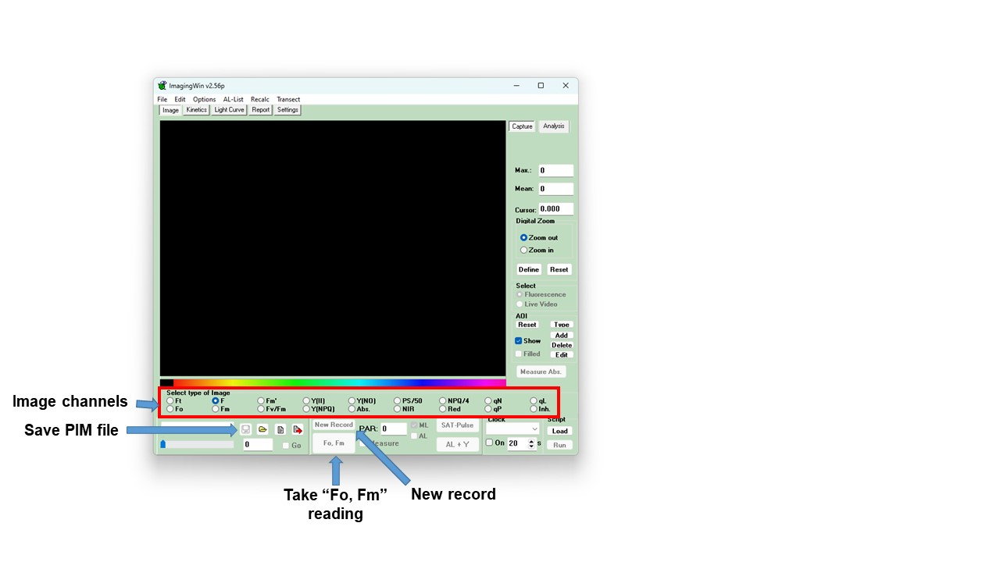

This document will guide you through the generation of pulse amplitude modulation (PAM) fluorometry analysis data:

- Using the Python script *get_fvfm_v1.py* to extract FvFm data from .xpim files generated using the ImagingWin software.
- Using the ImageJ macros *Contrast_area_quant_directory.txt* and *Contrast_area_quant_files.ijm* to extract plant area data from "contrast" TIF images.

## Imaging 24-well plates to generate .xpim files

_Described previously by Nick. See also "How to use the PAM camera.docx"_



1\. **Check the magnification of the PAM imaging camera**. This is located on the top of the PAM instrument. The magnification settings should be as shown in the image below. Note: this is *very important*, as an incorrect magnification can affect all downstream stages of the data analysis!

``` {r echo = FALSE, fig.cap="Correct magnification settings for the PAM camera"}
knitr::include_graphics("./screenshots/Screenshot_14.jpg")
# rotate.image(img, angle = 90, compress=NULL)
```

1\. Place the 24-well plates to be imaged in the drawer under the PAM imager laptop (in the microscopy room, 4.302). Leave them in the dark for 15 minutes. There is a notice on the door to the microscopy room: "Plants in dark/PAM imaging". Post this on the outside of the door to notify others that you require the room to stay dark.

2\. After 15 minutes, turn on the power supply and light source to the PAM imager (units to the left of the laptop). The switch for the light source is on the back of the unit.

3\. Password for the computer is "12345". Open ImagingWin software and select "MAXI" setting.

***Carry out following stages in the dark to keep plants dark-adapted***

4\. Lift the red shield around the imaging platform. Transfer the first 24-well plate from the drawer to the platform.
 
 - Note: *Place the plates flush against the barriers at the back and right side of the platform, to ensure uniform well positioning. This is very important for automated downstream analysis!*

5\. Lower the red shield before imaging the plate.

6\. On the ImagingWin GUI page, there is a large "Fo, Fm" button (see image above). Click on this to take image measurements.

7\. Above the "Fo, Fm" button, there are a series of options for image channels. Click on the "Fv/Fm" channel. The plants should be clearly highlighted against a black background.
 
 - If the plants are not clearly highlighted, they may not be fully dark-adapted. Return the plate to the drawer for at least 10 minutes, then repeat above steps.

8\. Left of the "Fo, Fm" button is a "save" icon. Click on that to save the output as a PIM file.
 
 - Save the file in your own folder within the Data_MAXI folder. Once saved, a comment file will open automatically. This can be closed without adding a comment.

9\. Click on "New Record" button, immediately above "Fo, Fm". Answer "no" to the prompt to save image data.

- Note: Selecting "New Record" will delete any unsaved data from the ImagingWin memory. Make sure you save the image as a PIM file before carrying out this stage.

10\. Repeat steps 4 to 9 for all plates.

## Extract photosynthetic efficiency (Y(II)) data from PIM files

### Step 1: Installation and set-up

This step only has to be carried out the first time you follow this protocol. For repeat use of the pipeline, skip to ~~Step 2~~ Step 1, section 4.

1\. Install Miniconda. Miniconda can be installed from "https://docs.conda.io/en/latest/miniconda.html". Install the version required for your operating system ("e.g. for Windows, click "Miniconda3 Windows 64-bit").

2\. Copy the "PAM_analysis_packages" folder to your local drive. This folder can be found at *\\sofs2.uni-koeln.de\\agzuccaro\\PAM_analysis_pipeline*.

3\. Open Anaconda Prompt (miniconda3). This should be available once Miniconda is installed. Use the Windows search bar to find the program.


4\. Navigate to the location where you have copied the "PAM_analysis_packages" folder. The easiest way to do this is to navigate to the correct folder using Windows File Explorer, then right click on the top banner and select "Copy address as text".


 Then, in Anaconda Prompt, enter "cd " then the location of the folder by pasting ('Ctrl' + 'v'):
 
```
cd C:\[path]\[to]\[your]\[folder]\PAM_analysis_packages
```

5\. Now create a new Conda environment, using the "get_fvfm_env.yml" file, in the "scripts" directory of the PAM_analysis_packages folder. To do this, enter the following command:
```
conda env create --name get_fvfm --file=scripts/get_fvfm_env.yml python=3.9
```
### Step 2: Loading the Conda environment and running "get_fvfm_v1.py"

1\. In Anaconda Prompt, navigate to the PAM_analysis_packages folder, as described above.

2\. Load the "get_fvfm" environment using the following command:
```
conda activate get_fvfm
```
 - The environment name in Anaconda Prompt should now change from ```(base)``` to ```(get_fvfm)```.
 
3\. Copy the .xpim files to be analysed into the "PAM_analysis_packages/input/xpim_files" directory.

4\. Ensure that the following directories do not contain any files from previous analyses:

 - "PAM_analysis_packages/debug/cropped_images"
 - "PAM_analysis_packages/input/tiff_files" and its subdirectory "tiff_frames"
 - "PAM_analysis_packages/output" and its subdirectory "threshold_output"
 - "PAM_analysis_packages/Plant_area_data" and its subdirectory "debug"

5\. To run the "get_fvfm_v1.py" script, enter the following command into Anaconda Prompt:
```
python get_fvfm_v1.py
```

 - Whilst the script is running, it will print the calculated FvFm values to the screen of Anaconda Prompt. It will also print the name of each plate image that is analysed and the total number of images analysed as part of the script. In addition, if the script finds anything unusual (e.g. records already present in the folders above which should be empty) then it will print a warning message.
 - Note: I have now added an additional python file to the folder “get_fvfm_black_plates_v1.py”. This file is to be used for analysis of images using the black cell culture plates provided by Sarstaedt (prod. No.: 94.6000.014).
 
6\. Once the script has finished running (message printed: ```End of script. Number of files analysed: [...]```) check the output folder. 

 - A file "FvFm_output.csv" should be present, which contains the Y(II) values of all the .xpim files.
 - In the "threshold_output" folder there should be a series of contrast images for each of your plates. These can be used to generate the plant area data...


## Extract area data from "Contrast" images

Plant area data will be extracted from contrast images using ImageJ and the "macro" file **"Contrast_area_quant_directory.txt"**
 - Note: I have now added an additional ImageJ macro file to the folder “Contrast_area_quant_black_plates_v2.txt”. This file is to be used for analysis of images using the black cell culture plates provided by Sarstaedt (prod. No.: 94.6000.014).

1\. Open the Contrast_area_quant_directory.txt file. On lines 4 and 7 there are the following commands:

```
input = '\\\\sofs2.uni-koeln.de\\agzuccaro\\PAM_analysis_pipeline\\PAM_analysis_packages\\output\\threshold_output\\'
```
...
```
output = '\\\\sofs2.uni-koeln.de\\agzuccaro\\PAM_analysis_pipeline\\PAM_analysis_packages\\Plant_area_data\\'
```
 - Note that the directory names are formatted strangely, with double or quadruple backslashes ("\\\\"): As the script interpreter defines backslash as having a special meaning, it is necessary to add additional backslashes to override this.
 
Edit the input and output paths to match your target directory. The input directory should be the "threshold_output" directory within your copy of the PAM_analysis_packages folder. The output directory can be the "Plant_area_data" folder, in your copy of the PAM_analysis_packages folder. As above, the easiest way to get these paths is to navigate to the correct folder using Windows File Explorer, then right click on the top banner and select "Copy address as text". Please note that it is necessary to **add additional backslashes to the path name**, once copied into the Contrast_area_quant_directory.txt file. For example:
```
input = C:\\[path]\\[to]\\[your]\\[folder]\\PAM_analysis_packages\\output\\threshold_output\\
```

2\. Once you have edited your version of the Contrast_area_quant_directory.txt file with the correct input and output locations, save and close the file. 

3\. Open ImageJ. Select "Plugins > Macros > Run... "


- Navigate to your PAM_analysis_packages folder and select "Contrast_area_quant_directory.txt".

- A number of windows should open up. Four windows show the results from the analysis. This data is also saved in the ouput directory, so they can be closed (I am yet to find a way of closing them automatically).

- An additional window named "Log" will also be generated:


- This file shows an overview of what the script has run, and should help with troubleshooting. The first two lines show the folder paths selected for the input and output files, as understood by the script. If you have trouble with running the script, check these lines to make sure the path names are being read correctly. The following lines in the Log file display which files have been analysed by the script. If 1) files of other formats (e.g. .csv files) or 2) other folders are present within the input directory, additional lines in the log will identify that they have been detected (but not processed). Again, hopefully this will help with troubleshooting.

- In your output directory a .csv files should now be present for each contrast image analysed. Additionally, in the "debug" folder, there should be a .jpg image of the contrast image with the areas analysed using the _"Analyse particles"_ ImageJ function have been collected. If you encounter unusual results during your analysis, or want to check that the images are being processed correctly, you can look in these files.

### Combining Y(II) with Total Area data

To collect your Y(II) data in a csv file along with the plant area generated using the ImageJ macro, run the **"combine_data.py"** script. In Anaconda Prompt, enter the following command:
```
python combine_data.py
```
In the "output" folder, a file named "Combined_output.csv" should now be present. This csv file should have four columns:

 - **Plate**: The name given of the plate analysed
 - **Well**: The number of the well analysed (see image below for well numbering system)
 - **Total Area**: The plant area output from ImageJ of the well
 - **FvFm**: The Y(II) value for the plants in the well
 
 Update (September 2023): A fifth column "Area_FvFm" has been included, which is the Total Area score x FvFm score.


